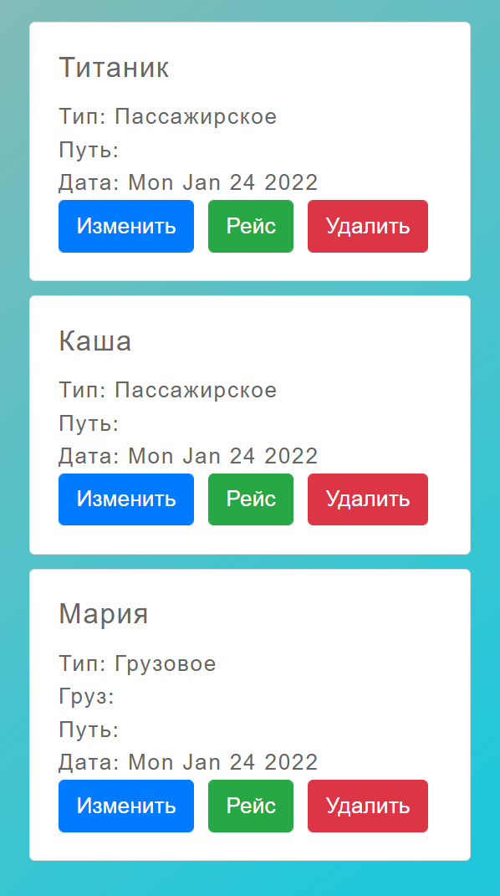

yarn - установка

yarn start - запуск

Создано CRUD приложение на основе фреймворка React

Начальный экран, когда список кораблей пуст:

Добавление нового судна:

- Тип судна: Грузовое или Пассажирское:

После добавления корабля есть возможность указать рейс, то есть пункт назначения. Если судно грузовое, то у него также присутствует поле груза, который вводится при указании рейса:

Страница рейса для грузового судна:

Страница рейса для пассажирского судна:

